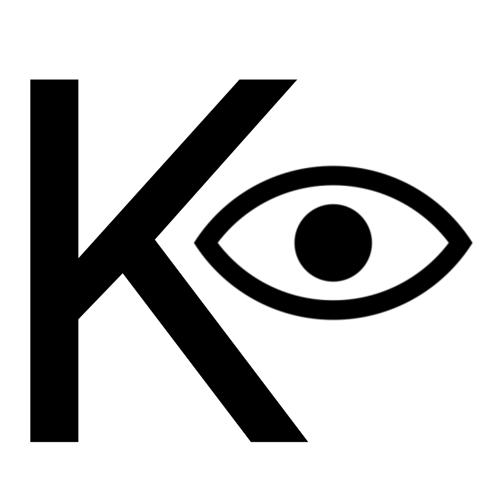

# camKapture

camKapture is an open source application that allows users to access their webcam device and take pictures or create videos.



## Features

- Cross-platform (GNU/Linux, Mac, Windows)
- Take pictures and record videos with the webcam.
- Keyboard based application
- Written in Python and OpenCV.

## License

```
camKapture is free software: you can redistribute it and/or modify
it under the terms of the GNU General Public License as published by
the Free Software Foundation, either version 3 of the License, or
(at your option) any later version.

camKapture is distributed in the hope that it will be useful,
but WITHOUT ANY WARRANTY; without even the implied warranty of
MERCHANTABILITY or FITNESS FOR A PARTICULAR PURPOSE.  See the
GNU General Public License for more details.

You should have received a copy of the GNU General Public License
along with camKapture. If not, see <http://www.gnu.org/licenses/>.
```

[](https://github.com/manojuppala/camKapture/blob/main/LICENSE)
